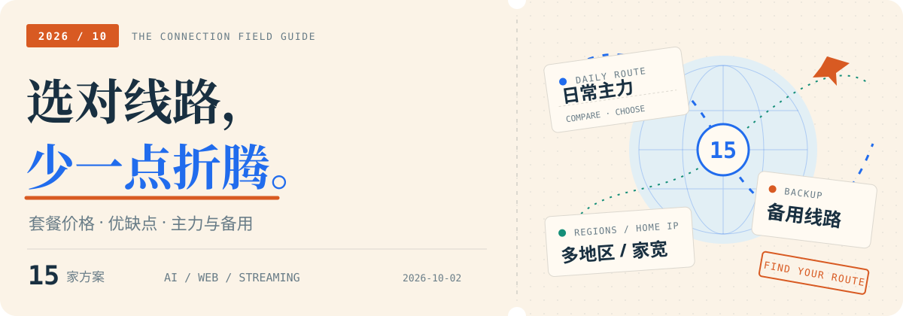
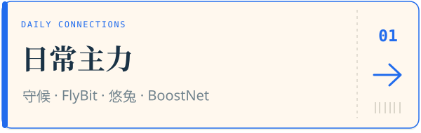
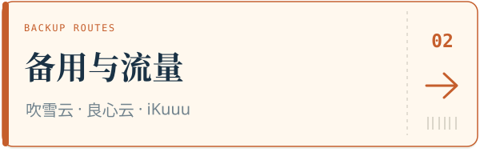
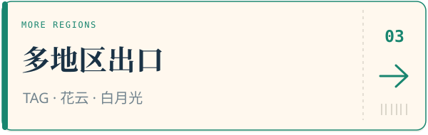
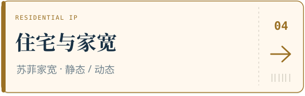
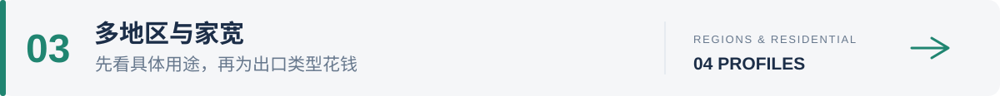

# 2026 机场推荐与机场测评｜套餐价格、优缺点与 AI 使用指南

<picture>
  <source media="(prefers-color-scheme: dark)" srcset="assets/guide-cover-dark.svg">
  <source media="(prefers-color-scheme: light)" srcset="assets/guide-cover-light.svg">
  
</picture>

  <kbd>15 家方案</kbd>&nbsp; <kbd>套餐对比</kbd>&nbsp; <kbd>优缺点直览</kbd>&nbsp; <kbd>原评测参考</kbd>

  <a href="#quick-picks"><kbd>⚡ 快速选择</kbd></a>&nbsp;
  <a href="#providers"><kbd>🧭 十五家详情</kbd></a>&nbsp;
  <a href="#all-prices"><kbd>🎟️ 价格与入口</kbd></a>&nbsp;
  <a href="#buying"><kbd>💡 怎么买</kbd></a>&nbsp;
  <a href="#evidence"><kbd>📚 评测来源</kbd></a>

十五家服务，价格、优势和短板放在一起看。这里整理已有机场测速、AI 与流媒体解锁评测，帮助你按预算选主力、找备用，或比较多地区和住宅出口。

主要用途：**ChatGPT / Claude / Gemini、日常网页、视频与下载。** 使用 Clash、v2rayN、sing-box 等客户端时，具体协议与限制在各家介绍里查。

> 资料整理于 **2026-10-02**。价格附来源日期；月付、季付、年付和一次性流量包分别标明。评测数据来自原作者的样本，购买以当前结算页为准。

## 先找到你的用途

点击一张卡片，直接查看对应介绍。

<table width="100%">
  <tr>
    <td width="50%"></td>
    <td width="50%"></td>
  </tr>
  <tr>
    <td width="50%"></td>
    <td width="50%"></td>
  </tr>
</table>

<strong>📋 展开按预算与用途的详细选择表</strong>

| 你最在意什么 | 先看这家 | 选择理由 |
| --- | --- | --- |
| **20 元内的日常主力** | [守候网络](#sntp)；[U1S1](#u1s1)作第二选择 | 小额月付，有评测记录可对照 |
| **提高主力预算** | [悠兔](#youtu) / [BoostNet](#boostnet) | 多入口、客户端及历次测试，付款周期见详情 |
| **15 元封顶，主要用 AI** | [FlyBit](#flybit) | 15 元 / 128GB，有分地区的 ChatGPT 样本 |
| **几元钱留一份备用** | [吹雪云](#chuixue) / [良心云](#liangxin) | 小月付成本低，先确认本地接入 |
| **流量多，想先花一元体验** | [iKuuu](#ikuuu) | 1 元日包与 12 元 / 300GB 付费档 |
| **多地区流媒体和不同出口** | [TAG](#tag) / [花云](#flowercloud) | 丰富落地或低倍率，按地区与付款周期比较 |
| **指定住宅 IP / 家宽需求** | [苏菲家宽](#sufe) | 普通机房、静态与动态家宽分档 |
| **高预算长期主力** | [奶昔](#nexitally) / [WgetCloud](#wgetcloud) | 先读近期状态、季付门槛与官方限制 |
| **其他比较项** | [宇宙云](#yuzhou) · [白月光](#byg) | 分别留意 AI 证据和季付门槛 |

如果只准备买一家，先从主力卡片看起；具体预算和其他用途可展开上表。备用等主力用顺后再补，不必一次购齐。

## 直达各家介绍

| 日常主力 | 备用与流量 | 多地区、家宽与高预算 |
| --- | --- | --- |
| [01 守候网络](#sntp) | [07 吹雪云](#chuixue) | [10 TAG](#tag) |
| [02 FlyBit](#flybit) | [08 良心云](#liangxin) | [11 白月光](#byg) |
| [03 U1S1](#u1s1) | [09 iKuuu](#ikuuu) | [12 苏菲家宽](#sufe) |
| [04 宇宙云](#yuzhou) |  | [13 花云](#flowercloud) |
| [05 悠兔](#youtu) |  | [14 奶昔](#nexitally) |
| [06 BoostNet](#boostnet) |  | [15 WgetCloud](#wgetcloud) |

每家按 **入口 → 套餐 → 优缺点 → 测试记录 → 怎么选** 阅读。只查价格时，可以展开下面的总表。

<strong>查看全部 15 家的参考价格与官网入口</strong>

表里的“建议”是本页的选购判断，不是统一测速排名。新资料与旧价冲突时，优先采用较新的记录；没核到新价的，直接标为旧价。

| 机场 | 参考价格与付款周期 | 本页建议 | 入口 |
| --- | --- | --- | --- |
| **守候 SNTP** | **18元 / 100GB**，2026-05评测 | **20元内的主力首选** | [官网入口](https://ncdn1.sntp.uk/auth/register?code=Zp1I34l1) |
| **FlyBit** | **15元 / 128GB**，2026-09套餐记录 | **15元预算首选，AI优先美日节点** | [官网入口](https://www.fastfastfast.buzz/#/register?code=szFx8WJU) |
| U1S1 | 20元 / 120GB，2026-08套餐记录 | 守候不适合本地网络时，再比较它 | [官网入口](https://njdsues.u1sat.homes/#/?code=bXrbElMZ) |
| 宇宙云 | 14.9元 / 100GB，2026-08资料 | 港日测速可参考，**AI主力不优先推荐** | [官网入口](https://tlsmvchy.yuzhoutttt3.click/#/?code=rZfRFpyF) |
| 悠兔 YouTu | 年包199元、全年200GB；150GB/月付39元为评测参考 | 多入口中档比较，先核对当前付款周期 | [官网入口](https://tw.youtu1.com/) |
| BoostNet | 49元/月、200GB；另有200元年付20GB/月 | AnyTLS与官方客户端，注意费用及限制 | [官网入口](https://jc.boostqz.com/) |
| **吹雪云** | **2元 / 128GB起**，频道宣传 | **低价备用，电信先看接入限制** | [官网入口](https://xn--9kqs1lo79d.com/#/register?code=MT7w7Ayt) |
| **良心云** | **2元 / 100GB；6元 / 1000GB**，2026-06评测 | **低价直连、大流量备用** | [官网入口](https://xn--9kqz23b19z.com/#/register?code=uvXCXsuI) |
| iKuuu | 12元/月、每30天300GB；1元日包30GB，2026-09核对资料 | 重流量或免费备用再看，AI主力不优先 | [官网入口](https://ikuuu.top/auth/register?code=BzrJ) |
| TAG | Special 162元/年、全年200GB；Bronze 185元/季、每月250GB | 多地区出口优先看它；低流量另看年度包 | [官网入口](https://tagss.pro/#/auth/rZcvLyyj) |
| 白月光 BYG | 66元/季、每月100GB，2026-08核对资料 | 不盲季付，先看零速节点和售后反馈 | [官网入口](https://www.sibker.com/register?invite_code=fRx8KXXq) |
| 苏菲家宽 | 静态家宽20元/月、250GB；普通机房9.9元/月、1000GB，2026-05资料 | 有住宅 IP 需求再选；联通可优先比较 | [官网入口](https://www.sufe.pro/register?code=91TGejUv) |
| 花云 FlowerCloud | 39元/月、150GiB；58元/月、400GiB | 多地区及0.2倍率实验节点 | [官网入口](https://huacloud.dev/) |
| Nexitally / 奶昔 | 第三方档案约74.55元 / 200GB；123.33元 / 500GB | 高预算比较项，留意服务波动 | [入口导航](https://xiaofeiji.best/airports/nexitally/) |
| WgetCloud | 第三方季价237元起；官方基础季付每30天230GB | 高预算比较，先核对会员中心价格 | [官网入口](https://wgetcloud.ltd/) |

通知频道和评测来源保留供核对。入口能打开不代表节点好用，暂时打不开也不能据此判定跑路。

---

## 日常主力

### 01 · 守候网络 SNTP｜20 元内的主力首选

<kbd>日常主力</kbd>&nbsp; <kbd>小额月付</kbd>

🔗 [官网入口](https://ncdn1.sntp.uk/auth/register?code=Zp1I34l1) · [发布页 2](https://cmt.shvip888.com) · [通知频道](https://t.me/s/SHWLGROUP)

**参考套餐：18 元/月，100GB。** 来自 2026 年 5 月评测。旧讨论里的 15 元、88GB 只当历史价格看。

#### 套餐价格

| 套餐 | 月付 | 季付 | 半年付 | 年付 | 每月流量 |
| --- | ---: | ---: | ---: | ---: | ---: |
| Lite Connect | 18元 | 49元 | 92元 | 173元 | 100GB |
| Core Essentials | 28元 | 76元 | 143元 | 269元 | 200GB |
| Plus Advantage | 38元 | 103元 | 194元 | 365元 | 350GB |
| Max Infinity | 48元 | 130元 | 245元 | 461元 | 500GB |
| Premium | — | — | — | 968元 | 1000GB |

价格来源：[2026-05-14评测](https://jichangblog.com/reviews-shouhouwangluo-3/)。季付、半年付、年付均为一次支付的总价，“—”表示该来源未列出对应付款方式。

#### 优势与不足

| 🟢 优势 | 🟠 需要留意 |
| --- | --- |
| 18元小月付能先试，后续有多档流量可选 | 旧的15元/88GB价格不能当作当前售价 |
| 历史记录包含普通及0.2倍率节点，可按节点节省扣量 | 高低倍率混合，选错节点会改变实际流量消耗 |
| 有多期晚高峰视频、速度及解锁图可对照 | 单次好成绩不说明每个节点、每个运营商都一样 |

**评测重点：** 5月14日文章记录日本节点晚高峰Speedtest约900Mbps以上，并展示港日4K视频与解锁图片。这是原作者当次测试的成绩，不是套餐保底速度。资料还标注多入口及IPLC/IEPL，线路归属属于来源描述。

#### 这家怎么选

守候放在前面，主要是评测材料比较齐。除了[5月14日那次晚高峰](https://jichangblog.com/reviews-shouhouwangluo-3/)，还有[4月30日的前一次测试](https://jichangblog.com/reviews-shouhouwangluo-2/)和[另一频道的历史记录](https://t.me/s/PushGoodCloud/767)，能看到普通节点、低倍率节点和不同后端的表现。

第一笔买18元100GB月付就够试。先留下几个能顺畅完成AI对话的节点，连续用过白天和晚间，再决定续费。0.2倍率省的是对应节点的扣量，不能把整个套餐都算成五倍流量。

如果晚高峰在自己的网络上明显不好用，就换下一家。资料较完整是优先试它的理由，实际连接才是续费的理由。

<a href="#providers"><kbd>↑ 返回目录</kbd></a>

---

### 02 · FlyBit｜15 元预算，月付与按量都能选

<kbd>15 元档</kbd>&nbsp; <kbd>月付 / 按量</kbd>

🔗 [官网入口](https://www.fastfastfast.buzz/#/register?code=szFx8WJU)

**参考套餐：15 元/月，128GB；不限时包 36 元/128GB 起。** 套餐记录见[yp7](https://yp7.net/posts/flybit-review-2026/)。

#### 套餐价格

| 每月流量 | 月付 | 季付 | 半年付 | 年付 |
| --- | ---: | ---: | ---: | ---: |
| 128GB | 15元 | 42元 | 75元 | 148元 |
| 192GB | 22元 | 60元 | 110元 | 216元 |
| 256GB | 28元 | 80元 | 140元 | 268元 |
| 512GB | 52元 | 148元 | 260元 | 498元 |

| 不限时流量包 | 一次性价格 |
| --- | --- |
| 128GB总流量 | 36元 |
| 256GB总流量 | 68元 |
| 512GB总流量 | 128元 |
| 1024GB总流量 | 238元 |

价格来源：[yp7，套餐核对于2026-09-08](https://yp7.net/posts/flybit-review-2026/)。不限时包不会每月补充流量；所有长周期价格都是对应周期总付款。

#### 优势与不足

| 🟢 优势 | 🟠 需要留意 |
| --- | --- |
| 月付和不限时包都有，日常与备用容易分开选 | 套餐资料标注不支持退款 |
| 来源记录不限设备，多设备共用同一份流量 | 用第三方订阅客户端，新手要学习导入、更新和切换 |
| 有可追溯Speedtest结果与地区使用记录 | 香港节点的ChatGPT存在不可用样本，不能全地区照搬 |

**客户端：** 来源列出Clash Meta、Hiddify、sing-box、Shadowrocket、Quantumult X、Surge、Stash七种导入入口。**试用：** 文章补充1天2GB，是否到账按实际账号确认。SS、Secure隧道及IEPL/中转属于套餐或服务方描述，不作为本文线路验证。

#### 一次晚高峰记录，地区差异直接看

| 节点地区 | 下行速度 | ChatGPT记录 |
| --- | ---: | --- |
| 美国 | 564.36Mbps | 流畅 |
| 日本 | 340.81Mbps | 流畅 |
| 新加坡 | 405.28Mbps | 流畅 |
| 香港 | 456.43Mbps | 不可用 |

来源：[Siilas，2026-08-13晚间](https://siilas.com/test/)。这些是当次节点样本，速度与AI可用性没有必然对应关系。

#### 这家怎么选

天天要用电脑和手机，15元月付更直观；偶尔在主力故障时顶一下，才考虑36元的不限时包。不限时买的是总流量，用完需要再买，不会每月重新给128GB。

AI用户先试美日节点，别被香港较低的延迟带着走。上面的原始记录就出现了“速度不错，ChatGPT却不可用”的香港样本，这正是按地区选节点的理由。

它适合已经会导入订阅的人。对完全新手，先把客户端、更新和切换学会，再买大档。退款限制和试用规则见[yp7](https://yp7.net/posts/flybit-review-2026/)，不要仅为年付折扣提前多付。

<a href="#providers"><kbd>↑ 返回目录</kbd></a>

---

### 03 · U1S1｜20 元档的第二选择

<kbd>20 元档</kbd>&nbsp; <kbd>主力备选</kbd>

🔗 [官网入口](https://njdsues.u1sat.homes/#/?code=bXrbElMZ)

**参考套餐：20 元/月，120GB；另有 96 元年付、每月60GB的记录。**

#### 套餐价格

| 套餐 | 一次付款 | 流量 | 付款方式 |
| --- | ---: | ---: | --- |
| 就是好用包 | 96元 | 60GB/月 | 年付 |
| 基础体验版 | 20元 | 120GB/月 | 月付 |
| 日常影音版 | 40元 | 300GB/月 | 月付 |
| 重度冲浪版 | 100元 | 700GB/月 | 月付 |
| 大流量版 | 180元 | 1500GB/月 | 月付 |

来源：[2026-08-03套餐核对](https://jichang168.com/airports/u1s1/)。96元年付折合8元/月，但必须一次付款。旧评测中的580元不限时包未出现在该轮套餐目录，本页不再把它列为在售选项。

#### 优势与不足

| 🟢 优势 | 🟠 需要留意 |
| --- | --- |
| 20元档即可月付，120GB够作为小额试用档 | 年付小包只有60GB/月，与月付档不是同一额度 |
| 有流媒体、延迟原图，包含具体异常节点 | 首轮测试没有速度及逐项AI结果，不能写成全部AI解锁 |
| 通用订阅适合已有Clash、Shadowrocket等客户端的用户 | 专线、带宽及并发宣传未在套餐核对页独立验证 |

**地区与协议：** [7月31日首轮记录](https://aidengta.blog/review/u1s1/)为VLESS、50节点，涉及港、台、日、新、美。香港TLS RTT约89～95ms，日本133～136ms，美国243～248ms；这是该作者的测试环境，不是任何用户的固定延迟。该轮YouTube、Netflix、Disney+整体解锁较好，香港HKG-01有YouTube地区例外。

#### 这家怎么选

守候在本地网络不合适，再试20元120GB这一档。U1S1有[流媒体与延迟测试](https://aidengta.blog/review/u1s1/)，速度图另看[二毛的文章](https://www.ermao.net/article/u1s1/)，两份材料的范围不同。

96元年付看起来单月便宜，但流量只有60GB/月，也要一次付款。第一次先花20元，确认每天需要的AI对话、上传与晚高峰连接都跑得通，再决定长周期是否划算。

套餐按[8月的核对记录](https://jichang168.com/airports/u1s1/)整理。旧文章里的580元不限时包已经不在那轮目录里，因此不再据此下单。

<a href="#providers"><kbd>↑ 返回目录</kbd></a>

---

### 04 · 宇宙云｜港日速度有资料，AI 主力往后放

<kbd>港日视频</kbd>&nbsp; <kbd>AI 证据有限</kbd>

🔗 [官网入口](https://tlsmvchy.yuzhoutttt3.click/#/?code=rZfRFpyF)；评测来源见[网指南](https://webzhinan.run/airport/providers/yuzhouyun)。

**参考套餐：14.9 元/月，100GB。**

#### 套餐与配置

| 项目 | 公开记录 |
| --- | --- |
| 入门月付 | 14.9元，100GB/月 |
| 更大流量 | 原评测提到942GB档，未给出可核对价格，不补猜价 |
| 协议 | 服务方标VLESS；原作者测试订阅为Shadowsocks兼容格式 |
| 客户端 | 自研客户端；第三方订阅获取需联系在线客服 |
| 测速样本 | 58节点，港20、美10、日10、新10、台5、马来西亚2、俄罗斯1 |
| AI | 来源未提供统一AI实测 |

来源：[HaiwaiLab，2026年8月文章与图注](https://haiwailab.lol/reviews/yuzhouyun/)；线路IEPL和流媒体覆盖为品牌资料标注。

#### 优势与不足

| 🟢 优势 | 🟠 需要留意 |
| --- | --- |
| 14.9元小月付，价格门槛低 | 没有足够AI证据，本页不优先推荐给AI主力用户 |
| 原样本港日吞吐较好，常用地区有多个节点 | 美新节点表现不齐，不能只拿最快节点说事 |
| 提供自研客户端，另有第三方导入方式 | 第三方订阅需咨询客服，操作不如直接复制顺手 |

#### 已有测速里的地区表现

| 地区 | 原文列出的节点平均速度范围 |
| --- | --- |
| 香港 | 80～129MB/s |
| 日本 | 92～124MB/s |
| 新加坡 | 52～116MB/s |
| 美国 | 28～78MB/s |
| 台湾 | 26～62MB/s |
| 马来西亚 / 俄罗斯 | 3～9MB/s |

测试环境为珠海联通9Gbps、32线程；文章日期8月11日，图注8月5日。**MB/s与Mbps不同，1MB/s约为8Mbps；这些数据不能直接与家庭宽带或其他测速后端排统一名次。**

#### 这家怎么选

主要使用港日网页和视频，可以把宇宙云放在15元档比较。原评测显示美新节点表现不齐，选地区时看具体样本，比只看最高峰值更有用。

只为ChatGPT、Claude、Gemini买主力，本页仍先选FlyBit。原因就是证据：宇宙云的[测速文章](https://haiwailab.lol/reviews/yuzhouyun/)和[当前资料页](https://webzhinan.run/airport/providers/yuzhouyun)都没有统一AI实测结论，速度好不能补上这项缺口。

已经在用，而且常用服务都顺畅，就按自己的体验续。这里的排序帮助第一次购买，不需要为了名次硬换服务。

<a href="#providers"><kbd>↑ 返回目录</kbd></a>

---

### 05 · 悠兔 YouTu｜多入口与动态倍率的中档主力

<kbd>中档主力</kbd>&nbsp; <kbd>隧道 / 专线</kbd>

🔗 [官网入口](https://tw.youtu1.com/) · [7月测速及套餐资料](https://gptvpnhelper.com/youtu/) · [GitHub更新记录](https://github.com/hwanz/SSR-V2ray-Trojan)

#### 套餐价格

| 方案 | 参考付款金额 | 流量 | 资料口径 |
| --- | ---: | ---: | --- |
| 轻量年包 | 199元/年 | **全年总共200GB** | 两份资料一致 |
| 150GB档 | 39元/月；210元/半年；400元/年 | 150GB/月 | 月付来自9月21日评测；较新GitHub列半年与年付 |
| 300GB档 | 170元/季；320元/半年；600元/年 | 300GB/月 | 本次读取的GitHub条目 |
| 500GB档 | 79元/月；220元/季；420元/半年；800元/年 | 500GB/月 | 月付为评测记录；其他周期见GitHub |
| 1000GB档 | 119元/月 | 1000GB/月 | 两份资料一致 |

来源：[评测页](https://gptvpnhelper.com/youtu/)与[GitHub条目](https://github.com/hwanz/SSR-V2ray-Trojan)。两页在部分价格、协议与开放周期上有差异，因此上表分别标来源；39元月付是否仍可新购要看当前后台，不写成确定在售。

#### 优势与不足

| 🟢 优势 | 🟠 需要留意 |
| --- | --- |
| 有多入口和混合线路，适合比较主力的冗余选择 | 隧道、专线的倍率不同，低档流量要按实际节点算 |
| 有不同运营商、视频与解锁图可查看 | SS旧记录与AnyTLS新记录并存，要按当前客户端说明配置 |
| 年度小总量包适合低频备用 | 年包不是每月200GB；有些小档需要较长预付 |

#### 测试记录与选法

[7月3日测速](https://gptvpnhelper.com/youtu/)来自广西移动2Gbps、6线程；1倍港新隧道样本表现较好，日美等节点有差异。解锁图标注的实际测试时间为7月1日，不能因为OpenAI列有结果就推断Claude、Gemini也已逐项通过。

想提高主力预算，又希望在多条入口之间留选择，可以比较悠兔。先看最短可购周期和自己运营商接近的图；若只剩半年起付，不要照着旧月付价充值。

<a href="#providers"><kbd>↑ 返回目录</kbd></a>

---

### 06 · BoostNet｜AnyTLS 与官方客户端的主力备选

<kbd>中档主力</kbd>&nbsp; <kbd>AnyTLS</kbd>

🔗 [官网入口](https://jc.boostqz.com/) · [历次三网测速](https://jichangtuijian.com/boostnet) · [节点与解锁评测](https://gptvpnhelper.com/boostnet/)

#### 套餐价格

| 每月流量 | 月付 | 季付 | 半年付 | 年付 |
| --- | ---: | ---: | ---: | ---: |
| 20GB | — | — | — | 200元 |
| 200GB | 49元 | 140元 | 260元 | 500元 |
| 400GB | 79元 | 220元 | 420元 | 800元 |
| 1000GB | 129元 | 350元 | 660元 | 939元 |
| 1500GB团队档 | 388元 | 888元 | — | — |

价格取[2026-09-28更新的测速文章](https://jichangtuijian.com/boostnet)。该来源另记录支付手续费6%～9%；不同入口最终实付以结算页为准，不拿表中标价当含费总价。

#### 优势与不足

| 🟢 优势 | 🟠 需要留意 |
| --- | --- |
| 有多期三网记录，资料新至2026年9月 | AnyTLS需要兼容的新客户端，老客户端可能不支持 |
| 官方客户端与通用订阅可比较 | 第三方客户端和官方客户端体验可能不同 |
| 月付主力与每月20GB年包覆盖不同用量 | 用完提前续费不一定立即补流量，需要看重置包规则 |
| 常用港、台、日、新、美地区有样本 | 有端口、邮件协议限制；不按游戏加速器推荐 |

#### 测试记录与选法

[历史合集](https://jichangtuijian.com/boostnet)包含9月15日移动、5月2日三网测试；[另一评测](https://gptvpnhelper.com/boostnet/)有7月的下载、解锁图。不同地区仍有低速和平台例外，所以不把“主流解锁”写成全部节点保证。

预算从20元提高到50元左右，BoostNet值得加入主力比较。先从200GB档试，客户端尽量按服务方当前建议选择；只需要少量备用，才考虑200元年包。资料对海外可用性有冲突，境外使用先核对当前入口，不能照旧介绍直接买。

<a href="#providers"><kbd>↑ 返回目录</kbd></a>

---

## 备用与大流量

### 07 · 吹雪云｜低价备用，先看 IPv6 和套餐规则

<kbd>低价备用</kbd>&nbsp; <kbd>留意 IPv6</kbd>

🔗 [官网入口](https://xn--9kqs1lo79d.com/#/register?code=MT7w7Ayt) · [通知频道](https://t.me/s/chuixueyun)

**参考价格：通知频道宣传 2 元/月、128GB 起。**

#### 价格与使用规则

| 项目 | 频道公开说明 |
| --- | --- |
| 入门月付 | 2元起，128GB/月 |
| 套餐类型 | 月付、不限时包；其他档位价格以后台为准 |
| 协议 | VLESS + Reality |
| 月付叠加 | 不同月付档只保留最新一个；同档延长时间，不重置当月流量 |
| 套餐共存 | 月付与不限时不能共存；不限时包可以累计 |
| 电信接入 | 频道特别要求开启IPv6 |

来源：[吹雪官方通知频道](https://t.me/s/chuixueyun)，规则按本次能读取的公告整理。不要把不同套餐同时下单，当作两份能并行使用的额度。

#### 优势与不足

| 🟢 优势 | 🟠 需要留意 |
| --- | --- |
| 2元小月付，备用测试成本很低 | 电信接入依赖IPv6，没开通时可能影响使用 |
| 有三网、拓扑和解锁图能查看 | 频道承认晚高峰限速及路由变化，不能当全天稳定承诺 |
| 有月付与累计不限时包可按频率选择 | 月付和不限时不能共存，切套餐前要看规则 |

**已有问题说明：** 频道提到22:00～24:00部分地区会降速，移动可能延迟正常却速度下降，联通可能因路由变化出现延迟升高；还公布过故障补偿。这些也是判断备用价值的一部分。三网图见[海豚编号218](https://t.me/haitun_channel/2450)，该样本标注商家送测。

#### 这家怎么选

备用的价值是主力连不上时能接上。先买2元小月付，导入订阅，实际连过几个节点；买完一直没试，关键时刻仍可能用不上。

电信用户先看IPv6要求和[编号218的三网图](https://t.me/haitun_channel/2450)。频道也写过晚高峰限速、路由变化和故障补偿，选择时把这些问题一起算进去。

“吹雪”有同名条目，[其他历史帖子](https://t.me/s/haitun_channel?q=%23%E5%90%B9%E9%9B%AA%E4%BA%91)可能指向不同域名。这里对应“吹雪云.com”，不把另外一家同名服务的好评混过来。

<a href="#providers"><kbd>↑ 返回目录</kbd></a>

---

### 08 · 良心云｜下载与视频备用，流量门槛低

<kbd>大流量</kbd>&nbsp; <kbd>下载备用</kbd>

🔗 [官网入口](https://xn--9kqz23b19z.com/#/register?code=uvXCXsuI)

**参考套餐：2 元/100GB、4 元/500GB、6 元/1000GB 月付。** 来自2026年6月评测。

#### 套餐价格

| 每月流量 | 月付 | 季付 | 半年付 | 年付 |
| --- | ---: | ---: | ---: | ---: |
| 100GB | 2元 | 6元 | 12元 | 24元 |
| 500GB | 4元 | 12元 | 24元 | 48元 |
| 1000GB | 6元 | 18元 | 36元 | 72元 |
| 5000GB | 20元 | 40元 | 80元 | 160元 |

来源：[2026-06-20第七次评测](https://jichangblog.com/reviews-liangxinyun-7/)。原表另列一次性21元/1000GB与89元/5000GB，但有效期和续购规则没有在该表展开，购买前需核对；不把它解释成每月自动补充。

#### 优势与不足

| 🟢 优势 | 🟠 需要留意 |
| --- | --- |
| 2～6元月付就有多个流量档，大文件与视频备用成本低 | 公开评测定位为直连，地区、运营商和出口拥堵会影响体验 |
| 有多期视频与解锁记录，能往前比较 | 视频加载样本不能证明三家AI都能持续工作 |
| 资料标注20设备及统一1倍率，多端使用方便 | 设备、带宽和解锁是来源口径，本文没有逐项购买验证 |

**测试摘要：** 6月20日原文展示香港、新加坡4K加载及流媒体图。本文不把YouTube瞬时“连接速度”当作独立Speedtest成绩，也不把“无日志”等宣传当成经过审计的事实。

#### 这家怎么选

只想留一份备用，2元小包就够试；经常下载或看视频，再考虑6元1000GB。大流量确实便宜，但额度多不代表每个时段都能舒服地跑完。

它有[多次复测](https://jichangblog.com/reviews-liangxinyun-7/)和[更早的记录](https://jichangblog.com/reviews-liangxinyun-5/)可对照。[与鲤云的比较视频](https://www.youtube.com/watch?v=RO0U10YZW24)由作者自称自费测试，可补充观看；本文没有逐帧复核。

这类套餐适合分担视频和下载，先看自己的运营商表现再续。本文对应“良心云.com”，其他同名站点不合并评价。

<a href="#providers"><kbd>↑ 返回目录</kbd></a>

---

### 09 · iKuuu｜免费入门、1 元日包与大流量付费

<kbd>免费 / 日包</kbd>&nbsp; <kbd>流量优先</kbd>

🔗 [官网入口](https://ikuuu.top/auth/register?code=BzrJ) · [登录页](https://ikuuu.org/) · [地址与后台说明](https://jichangtuijian1.com/pianyijichang/ikuuu)

**参考套餐：12元/月、每30天300GB；另有1元日包和免费档。** 来自2026-09-03第三方后台核对记录。

#### 免费档与付费价格

| 方案 | 一次付款 | 流量 | 周期 |
| --- | ---: | ---: | --- |
| 免费档 | 0元 | 50GB/月，签到另加随机流量 | 每月重置 |
| VIP一日 | 1元 | 30GB | 1天 |
| VIP月付 | 12元 | 每30天300GB | 1个月 |
| VIP季付 | 30元 | 每30天300GB | 3个月 |
| VIP半年 | 60元 | 每30天300GB | 6个月 |
| VIP年付 | 108元 | 每30天300GB | 12个月 |

来源：[2026-09-03后台核对记录](https://jichangtuijian1.com/pianyijichang/ikuuu)。这是第三方当日核查，不是本文登录后台。半年档与季付均折合10元/月，半年没有额外单月折扣。

#### 节点与限制

| 项目 | 来源记录 |
| --- | --- |
| 免费档 | 7个日本节点、50Mbps限速、最多5设备 |
| 免费保障 | 公告不保证可用；00:00～13:00无人值守 |
| 付费地区 | 29节点：香港11、日本11、新加坡3、美国2、台湾1、韩国1 |
| 节点倍率 | 香港部分0.8倍；新台部分2倍；美国1.5倍；日本有低倍率下载专用 |
| 下载规则 | 来源明确不适合BT，不能把下载节点解释成允许BT |

#### 优势与不足

| 🟢 优势 | 🟠 需要留意 |
| --- | --- |
| 免费档和1元日包适合先熟悉入口、客户端 | 免费档无可用性保障，不能当唯一工作线路 |
| 12元300GB，付费流量门槛低 | 节点倍率不同，300GB不等于所有节点都能跑300GB实际流量 |
| 有域名查询和后台记录，入口找回比较清楚 | 节点目录核查不等于连续晚高峰速度测试 |

**购买建议补充：** 先用日包或月付体验付费节点；季付、半年、年付都按同一付费规格供流量，不要把半年总付款当成一次性600GB。

#### 这家怎么选

刚开始接触订阅，免费档可以先熟悉入口和客户端；想了解付费节点，1元日包更直接。免费档没有可用性保障，也不代表付费档表现。

准备续费时，12元月付先用一轮。季付和半年都折合10元/月，半年没有额外单月折扣，没有必要仅为价格多押三个月。签到随机赠送的流量也不要预先算进长期用量。

[后台核对文章](https://jichangtuijian1.com/pianyijichang/ikuuu)对域名、节点和限制写得清楚，但它不是连续速度评测。免费备用可以留，为AI购买唯一主力，本页仍先比较守候或FlyBit。

<a href="#providers"><kbd>↑ 返回目录</kbd></a>

---

## 多地区与家宽

### 10 · TAG｜多地区出口与丰富落地类型

<kbd>多地区</kbd>&nbsp; <kbd>家宽 / 商宽</kbd>

🔗 [官网入口](https://tagss.pro/#/auth/rZcvLyyj) · [tagweb.vip](https://tagweb.vip/)；备用入口资料：[jdnei/TAG](https://github.com/jdnei/TAG)。评测：[长期记录](https://github.com/xiaoming2028/TAG-VPN) · [套餐与视频样本](https://gptvpnhelper.com/tag/)

**参考套餐：Special 162元/年，全年共200GB；Bronze 185元/季，每月250GB；Silver 114元/月，每月500GB。** 价格见[2026年8月资料](https://gptvpnhelper.com/tag/)及[GitHub套餐记录](https://github.com/jdnei/TAG)。

#### 套餐价格与设备限制

| 套餐 | 付款金额 | 流量 | 设备 | 流量用完后的手动重置价 |
| --- | ---: | ---: | ---: | ---: |
| Special | 162元/年 | **全年总共200GB** | 5台 | 92元/次 |
| Bronze | 185元/季 | 250GB/月 | 10台 | 40元/次 |
| Silver | 114元/月 | 500GB/月 | 10台 | 87元/次 |
| Gold | 219元/月 | 999GB/月 | 10台 | 150元/次 |

来源：[2026-08-24资料](https://gptvpnhelper.com/tag/)。Special一次发全年额度；其他常规档按月重置。提前耗完时，续费并不自动立刻补满，来源列有单独重置费。

#### 优势与不足

| 🟢 优势 | 🟠 需要留意 |
| --- | --- |
| 多地区、多种家宽或商宽落地，冷门地区需求更容易找到选择 | 常用地区够用的人，可能用不到这部分额外成本 |
| 支持官方及通用客户端，兼顾简单连接与自定义 | 常规服务有地区限制，海外、港澳台及新疆需先核对版本 |
| 有年度小总量包与月重置常规档，适合不同使用频率 | 低总价档是年付或季付，预付周期更长 |
| 原文有历史视频及解锁记录 | SSH22、高位端口、传统邮件协议及TikTok有明确限制说明 |

**可直接参考的样本：** 8月视频截图为4K 25帧，连接速度约216Mbps，1587帧丢1帧；它说明当次播放顺畅，不证明全部节点零丢包。具体口径与图见[原文](https://gptvpnhelper.com/tag/)。

#### 这家怎么选

TAG值得额外花钱的地方，是地区与落地选择多。经常换流媒体地区、需要不同出口，可以看[长期使用记录](https://github.com/xiaoming2028/TAG-VPN)；只用几个常见地区，低价主力往往就够了。

低流量或备用可以研究Special，但200GB是全年总额；日常主力看Bronze，每月250GB、一次付185元。两种流量算法差很多，先按自己的用量算，再选付款周期。

开发者要读[端口与地区限制](https://gptvpnhelper.com/tag/)。网页可用不代表SSH和所有邮件协议都能走。家宽也不是私人独享IP或账号保证。

<a href="#providers"><kbd>↑ 返回目录</kbd></a>

---

### 11 · 白月光 BYG｜季付门槛与节点差异要一起看

<kbd>季付起步</kbd>&nbsp; <kbd>关注节点差异</kbd>

🔗 [官网入口](https://www.sibker.com/register?invite_code=fRx8KXXq) · [通知频道](https://t.me/s/bygpd)。评测：[三网原帖](https://t.me/sstrojan/3659?single=) · [测速与套餐核对](https://jichangnote.com/reviews/baiyueguang/)

**参考入门：66元/季，每月100GB。** [机场笔记2026年8月24日的套餐核对](https://jichangnote.com/reviews/baiyueguang/)记录没有月付，并标注不支持退款；是否新增套餐看当前后台。

#### 套餐价格：季付总价，别误看成月付

| 套餐 | 一次付款 | 每月流量 | 折合每月 | 设备数（卡片标注） |
| --- | ---: | ---: | ---: | ---: |
| 小包 | 66元/季 | 100GB | 22元 | 5台 |
| 中包 | 126元/季 | 250GB | 42元 | 5台 |
| 大包 | 156元/季 | 400GB | 52元 | 5台 |
| 超大包 | 216元/季 | 750GB | 72元 | 5台 |
| 不差钱 | 231元/季 | 900GB | 77元 | 5台 |
| 旗舰包 | 2500元/年 | 2500GB | 208.33元 | 10台 |

来源：[2026-08-24套餐核对](https://jichangnote.com/reviews/baiyueguang/)。该轮无月付，标不支持退款。旗舰卡片宣传的折合价与2500元年价有冲突，表中208.33元是2500÷12的数学结果，不能替服务方认定最终售价。

#### 优势与不足

| 🟢 优势 | 🟠 需要留意 |
| --- | --- |
| 100～900GB常规档梯度清楚，按真实用量选即可 | 最低一次付66元，不能只付22元试一个月 |
| 有三网、单线程、拓扑与解锁图片 | 存在晚高峰拥堵与客服响应的用户反馈 |
| 一次原样本涉及较多地区标签 | 冷门地区往往只有单节点，个别地区零速问题明显 |
| 有套餐和原始测试细节可对照 | 不退款、流量重置口径及部分宣传价需要进一步确认 |

**2026-07-17测试结果：** 108节点中83个非零、25个零速。香港10节点均非零，平均下载14.37MB/s、TLS RTT约160.7ms；台湾4节点中3个零速。这是历史单次样本，不直接定性今天仍故障，也不能把节点名称的79地区当已验证的出口覆盖。

#### 这家怎么选

66元除以3是22元，但新用户第一次要付66元。没有月付、资料又标不退款，这就是本页没有把它放到默认首选的原因。

[三网原帖](https://t.me/sstrojan/3659?single=)有好评，也有部分节点起不来和售后反馈；[108节点样本](https://jichangnote.com/reviews/baiyueguang/)还能看到零速节点。要选自己常用地区的可用线路，不能只看总节点数。

有试用机会，或者已经确认本地接入和售后条款，再考虑最小季付。已经用得顺的老用户可以按真实体验续，不必因这份清单的排序硬换。

<a href="#providers"><kbd>↑ 返回目录</kbd></a>

---

### 12 · 苏菲家宽｜按住宅出口需求选套餐

<kbd>住宅出口</kbd>&nbsp; <kbd>静态 / 动态</kbd>

🔗 [官网入口](https://www.sufe.pro/register?code=91TGejUv)。评测：[BaoBao原文](https://baobaoap.com/archives/144.html) · [三网与IP检测](https://t.me/s/sstrojan/3648)

**2026年5月评测参考：普通机房档9.9元/月、1000GB；美国静态家宽20元/月、250GB；动态家宽有30～50元档。** 价格出处：[BaoBao的原评测](https://baobaoap.com/archives/144.html)。

#### 套餐价格与出口类型

| 档位 | 月付 | 每月流量 | 主要区别 |
| --- | ---: | ---: | --- |
| 普通大流量 | 9.9元 | 1000GB | **普通机房，不含家宽**；资料标100Mbps |
| 美国静态家宽 | 20元 | 250GB | 静态住宅出口；资料标500Mbps |
| 美西Frontier动态 | 30元 | 420GB | 动态住宅出口 |
| 40元家宽档 | 40元 | 550GB | AT&T、Verizon、T-Mobile等不同选择，按档核对 |
| 星链 / 双ISP等档 | 50元 | 800GB | 美日等对应家宽方案，具体节点随档位 |

来源：[BaoBao，2026-05-24](https://baobaoap.com/archives/144.html)，该文记录最多5设备。表里的速率是套餐资料，不是本文测得速度。

#### 优势与不足

| 🟢 优势 | 🟠 需要留意 |
| --- | --- |
| 普通机房、静态和动态住宅出口可分开购买 | 最便宜9.9元档没有家宽，不能混用宣传 |
| 有三网、拓扑和IP检测图可看 | 原评测认为电信、移动表现有差异，联通较全面 |
| 20元就能比较静态住宅方案，不必直接上50元档 | 原帖也指出稳定性短板，IP质量好不等于线路永远顺 |
| 对确实需要住宅出口的人选择较细 | 家宽不自动等于私人独享、账号免风控或所有服务可用 |

**评测环境：** [小众机场](https://t.me/s/sstrojan/3648)为广东联通1Gbps、广西移动2Gbps、长沙电信2Gbps，资料涉及海外中转、直连及VLESS/Hy2/SS。不同前置与出口会影响实际体验，别只看一张IP检测分数。

#### 这家怎么选

苏菲适合确实有住宅出口需求的人。9.9元大流量档是普通机房节点，20元静态家宽和更贵的动态档才按住宅出口讨论，不能把几种产品的宣传拼成一份套餐。

[三网评测](https://t.me/s/sstrojan/3648)认可IP质量，也指出运营商差异和稳定性短板。联通可以优先比较；电信、移动更要看自己的接入。出口是家宽，前面的连接仍可能慢或波动。

需要美国静态住宅出口，先比较20元档；指定运营商或动态IP，再研究更高档。手里的AI线路已经顺，且没有这类需求，就不用单为“家宽”换服务。

<a href="#providers"><kbd>↑ 返回目录</kbd></a>

---

### 13 · 花云 FlowerCloud｜多地区落地与低倍率实验节点

<kbd>多地区</kbd>&nbsp; <kbd>0.2 倍率</kbd>

🔗 [官网入口](https://huacloud.dev/) · [2026年7月复测](https://baobaoap.com/archives/33.html) · [地区与历史资料](https://xiaofeiji.best/airports/flowercloud/)

#### 套餐价格

| 套餐 | 参考付款金额 | 每月流量 |
| --- | ---: | ---: |
| Air | 128元/年 | 20GiB |
| Lite | 39元/月 | 150GiB |
| Plus | 58元/月 | 400GiB |
| Max | 113元/月 | 1000GiB |
| Enterprise Basic | 500元/月 | 3000GiB |
| Enterprise | 780元/月 | 5000GiB |

来源：[BaoBao的7月复测](https://baobaoap.com/archives/33.html)。原表单位为GiB，本文保留；Air是每月20GiB的年付订阅，与TAG、悠兔的年度总流量包不同。

#### 优势与不足

| 🟢 优势 | 🟠 需要留意 |
| --- | --- |
| 主流与冷门地区落地较多，适合比较地区出口 | 部分节点限速，晚高峰和用户分组可能影响体验 |
| 原评测记录4个0.2倍率实验节点 | 只有对应节点低倍率，不能把全套餐统一放大 |
| 39元档可月付，年付小档另有用途 | Plus较旧记录涨价、减流量，不能沿用旧单价 |
| 有复测、拓扑与在线状态资料 | 过境线路判断含推测，不能写成已确认的物理专线归属 |

#### 这家怎么选

花云补的是多地区和落地类型选择。[复测文章](https://baobaoap.com/archives/33.html)同时写出了低倍率、地区和短板，[汇总页](https://xiaofeiji.best/airports/flowercloud/)可继续查历史反馈。

普通主力先从39元Lite比较；确实需要较多视频、下载，再算58元Plus是否合适。0.2倍率可以省扣量，但要先确认对应节点在自己网络上能用。只有文字AI需求，先试现有低预算线路，不用为了冷门地区买大档。

<a href="#providers"><kbd>↑ 返回目录</kbd></a>

---

## 高预算

### 14 · Nexitally 奶昔｜历史资料丰富，也要看服务波动

<kbd>高预算</kbd>&nbsp; <kbd>关注近期状态</kbd>

🔗 [官网导航与套餐档案](https://xiaofeiji.best/airports/nexitally/)

**第三方套餐参考：约74.55元/200GB、123.33元/500GB月付。不同套餐与可售情况按当前页面确认。**

#### 常见套餐价格

| 套餐 | 月付参考 | 半年付 | 年付 | 每月流量 | 设备 |
| --- | ---: | ---: | ---: | ---: | ---: |
| Air Basic Service | 74.55元 | 378元 | 655.2元 | 200GB | 2台 |
| Basic Service | 123.33元 | 623.7元 | 1157.52元 | 500GB | 2台 |

来源：[小飞机套餐档案](https://xiaofeiji.best/airports/nexitally/)，本次读取于2026-10-02。Basic资料标称最高2000Mbps，不等于实际保证速度；Air的可售性与所有价格以当前后台为准。Premium等附加档不与基础套餐混算。

#### 优势与不足

| 🟢 优势 | 🟠 需要留意 |
| --- | --- |
| 有多期三网、拓扑及解锁资料，历史积累较多 | 2026年4～5月评测曾更新服务波动，不可只摘早期好评 |
| 原档案记录多地区和不同运营商样本 | 电信、联通、移动结果差异明显，本地网络决定体验 |
| 两个常规档流量清楚，可按200或500GB选 | 月付金额高，常规档设备数量少，家庭多端需先核对 |

**历史数据怎么读：** [汇总页](https://xiaofeiji.best/airports/nexitally/)给出电信19.51、联通56.46、移动54.94的“MB”速度字段，并按多期样本汇总。来源单位只写MB，本文不自行补成确定MB/s；也不把其AI“100%”汇总等同于今天所有节点都可用。近期波动补充见[茶波更新](https://clashx.pro/nexitally-review/)。

#### 这家怎么选

奶昔有[三网与历史测速](https://clashx.pro/nexitally-review/)，同一篇文章也追加了2026年4～5月的服务波动。准备购买时，把后续更新读完，不只看早期好评。

[档案](https://xiaofeiji.best/airports/nexitally/)列出不同价格和流量档位。不要拿低档价格、大档流量和历史最高速度，拼成一份实际买不到的“性价比套餐”。

已用得顺的人按实际体验续。新用户先了解近期恢复情况和套餐可售性，再月付比较；高价本身不足以把它放成本页默认首选。

<a href="#providers"><kbd>↑ 返回目录</kbd></a>

---

### 15 · WgetCloud｜规格清楚的高预算比较项

<kbd>高预算</kbd>&nbsp; <kbd>季付 / 年付</kbd>

🔗 [官网入口](https://wgetcloud.ltd/) · [官方帮助中心](https://help-info.wgetcloud.org/zh/category/5bi46keb6zeu6aky-t89v47/) · [已有使用与测速记录](https://github.com/xiaoming2028/WgetCloud)

#### 套餐价格与官方规格

| 档位 | 第三方参考季价 | 季付每30天流量 | 年付每30天流量 | 速度上限 | 在线公网IP / 并发 |
| --- | ---: | ---: | ---: | ---: | ---: |
| 基础 | 237元 | 230GB | 280GB | 200Mbps | 3个 / 300 |
| 优质 | 267元 | 250GB | 320GB | 300Mbps | 4个 / 800 |
| 精品 | 297元 | 270GB | 360GB | 500Mbps | 5个 / 1500 |

**规格取[官方套餐说明](https://help-info.wgetcloud.org/zh/article/5awx6asq5yy65yirloacies7gos5ioikguecuseo5zcr6lst5lmw5rwb56ilkq-1oeyl5w/)，本次读取于2026-10-02；价格取[第三方8月资料](https://gptvpnhelper.com/wgetcloud/)。** 官方公开帮助页没有金额，当前价需在会员中心核对。第三方基础档写200GB，与官方季付230GB不同，这里采用官方流量；不把两份资料当作本文已看到的完整在售订单。

#### 优势与不足

| 🟢 优势 | 🟠 需要留意 |
| --- | --- |
| 三档限速、流量、公网IP及并发有官方明细 | 当前新购提供季付和年付，首次预付金额更高 |
| 常用五地区共15节点，精品再加14个地区 | 冷门地区官方不保证性能或各种服务可用 |
| 策略与规则文档丰富，便于按服务分流 | 无免费试用，钱包充值不退款，先看清订单再付 |
| 有作者长期使用和不同时间的测速资料 | 官方明确不承诺任何AI产品可用，不能写“永久AI解锁” |

#### IP数不是设备台数

按[官方解释](https://help-info.wgetcloud.org/zh/article/ip-n48gc0/)，同一Wi-Fi上的电脑、手机、平板可共用一个公网IP，手机改用移动数据会再占一个。并发连接另算，所以不能把基础档的3个IP简单说成只能装3台设备。

#### 这家怎么选

预算足、常用地区比较固定，又愿意按公网出口规划设备，可以研究WgetCloud。[GitHub使用记录](https://github.com/xiaoming2028/WgetCloud)有2026年3月的上海电信样本及平台例外，不是所有地区都一个结果。

首次只考虑最短可购周期，不为优惠超额充值。看AI用途时，把[官方不作可用性承诺的说明](https://help-info.wgetcloud.org/zh/article/ai-99p7se/)一起读完；它适合高预算比较，不作为低价入门的默认选择。

<a href="#providers"><kbd>↑ 返回目录</kbd></a>

---

## 历史风险反馈

| 机场 | 原始反馈 | 本页决定 |
| --- | --- | --- |
| 万达云 | [2026-09-03，Issue #318](https://github.com/limbopro/Paolujichang/issues/318)：用户报告节点、客服及工单异常 | **先跳过** |
| 贝贝云 | [2026-01-15，Issue #167](https://github.com/limbopro/Paolujichang/issues/167)：用户报告长期不可用和订阅异常 | **先跳过** |
| 海獭 HaitaVPN | [2025-08-06，Issue #114](https://github.com/limbopro/Paolujichang/issues/114)：用户报告持续不可用、无法联系 | **不靠旧推荐下单** |

这些是用户反馈，不等于本文独立证实跑路。但对新用户，已经有更清楚的选择，没必要把钱花在恢复情况未核实的服务上。后续有恢复证据再重新评估。

## 最后怎么买

**只买一家：20元以内先守候，15元封顶选FlyBit。**

**需要备用：先用主力一段时间，再加吹雪或良心云的小月付。** 按参考价，主力加低价备用约17～26元。备用能在主力故障时连上才有价值，不必为了“两家”硬凑套餐。

**工作依赖AI：少折腾，比多买流量重要。** 先把目标服务的登录、持续对话、文件上传和代码工具跑通，再看晚上是否频繁断连。测速只能回答速度，不能替你回答这些问题。

不知道怎么记，就用这张表。连续记几个工作日，再决定续哪家。

| 时间 | 机场 / 节点 | 本地运营商 | ChatGPT | Gemini | Claude | 断连 / 验证码 |
| --- | --- | --- | --- | --- | --- | --- |
| 白天 |  |  |  |  |  |  |
| 20:00～24:00 |  |  |  |  |  |  |

## 评测来源

<strong>展开原始评测、日期与测试环境</strong>

下面把“评测、测速、解锁测试、套餐核对”分清楚，方便直接找到原文和图。

| 机场 | 可直接查看的资料 | 日期 / 环境 | 能参考什么 | 主要限制 |
| --- | --- | --- | --- | --- |
| 守候 | [第 3 次晚高峰测试](https://jichangblog.com/reviews-shouhouwangluo-3/) · [第 2 次测试](https://jichangblog.com/reviews-shouhouwangluo-2/) | 2026-05-14、04-30 | 视频、Speedtest、解锁图片及套餐 | 文内有购买入口；非本文复测 |
| 守候 | [推个鸡场测速原帖](https://t.me/s/PushGoodCloud/767) | 包含标为 2025-02-08 的价格图；多种测速后端 | 单线程、测速、拓扑、解锁 | 历史图；不是 2026 当前性能 |
| 宇宙云 | [HaiwaiLab 测速与分析](https://haiwailab.lol/reviews/yuzhouyun/) | 文章 2026-08-11；图注环境珠海联通 9Gbps、32 线程，标 2026-08-05 | 节点测速图、不同地区表现 | AI 未标注；文章日期与图注日期应分开 |
| 宇宙云 | [网指南资料页](https://webzhinan.run/airport/providers/yuzhouyun) | 参数资料标为 2026 年 8 月 | 套餐和资料缺口 | 推广合作页；当前可读版本未提供统一 AI 实测 |
| U1S1 | [AI灯塔首轮解锁与延迟测试](https://aidengta.blog/review/u1s1/) | 2026-07-31，50 节点 | 流媒体、TLS RTT、异常节点 | 明确未测速、未逐项测试 AI |
| U1S1 | [机场168套餐核对](https://jichang168.com/airports/u1s1/) · [二毛评测与测速图](https://www.ermao.net/article/u1s1/) | 套餐核对标为 2026-08-03；测速日期以原图为准 | 月付、年付区别及已有测速截图 | 有推广入口；线路宣传不等于验证 |
| FlyBit | [Siilas 节点记录](https://siilas.com/test/) · [yp7 套餐及使用资料](https://yp7.net/posts/flybit-review-2026/) | Siilas 含 2026-08-13 晚间；yp7 更新 2026-09-27 | Speedtest 结果链接、节点使用表现及价格 | yp7 2026-08-18 后不再自行测试 |
| iKuuu | [后台、签到、节点与域名核对](https://jichangtuijian1.com/pianyijichang/ikuuu) | 作者标明 2026-09-03 | 免费档限制、签到样本、入口可达性 | 以后台及入口核查为主，不能当连续速度评测 |
| 吹雪云 | [海豚测速原帖：编号 218](https://t.me/haitun_channel/2450) · [同名条目对照](https://t.me/s/haitun_channel?q=%23%E5%90%B9%E9%9B%AA%E4%BA%91) | 电信、联通、移动测试图；具体时间以原帖为准 | 单线程、多线程、拓扑及流媒体 | **商家送测**；同名旧条目指向不同域名 |
| 良心云 | [第 7 次测试](https://jichangblog.com/reviews-liangxinyun-7/) · [第 5 次测试](https://jichangblog.com/reviews-liangxinyun-5/) | 2026-06-20、05-12 | 视频加载、解锁、历史复测与价格 | 有购买跳转；不能推断所有运营商体验 |
| 良心云 | [良心云与鲤云视频比较](https://www.youtube.com/watch?v=RO0U10YZW24) | 2026-08-15 | 视频作者描述涵盖速度、流媒体与 AI | 作者自称自费；本文未逐帧复核视频 |
| TAG | [GitHub长期记录](https://github.com/xiaoming2028/TAG-VPN) · [2026年8月资料与视频样本](https://gptvpnhelper.com/tag/) | 历史记录跨2022～2025；资料更新2026-08-24 | 地区选择、套餐周期及视频样本 | 年度总流量与月度流量不同；不可把历史表现当当前保证 |
| 白月光 | [三网测速原帖](https://t.me/sstrojan/3659?single=) · [108节点测评](https://jichangnote.com/reviews/baiyueguang/) | 后者测速2026-07-17，套餐核对2026-08-24 | 单线程、拓扑、零速节点及付款结构 | 仅季付及以上资料；已有拥堵和售后反馈 |
| 苏菲家宽 | [BaoBao价格与IP检测](https://baobaoap.com/archives/144.html) · [小众机场三网记录](https://t.me/s/sstrojan/3648) | BaoBao发布2026-05-24；广东联通、广西移动、长沙电信 | 家宽与普通档区别、IP质量、运营商差异 | 家宽标签不保证独享或免风控；套餐按后台确认 |
| Nexitally | [茶波三网测速及状态更新](https://clashx.pro/nexitally-review/) · [小飞机汇总](https://xiaofeiji.best/airports/nexitally/) | 原文 2023-11-20；后续更新至 2026-05-10 | 三网截图、解锁、服务波动与套餐 | 历史速度不能代替当前状态 |
| 悠兔 | [广西移动测速与解锁](https://gptvpnhelper.com/youtu/) · [GitHub更新](https://github.com/hwanz/SSR-V2ray-Trojan) | 测速2026-07-03，解锁07-01，套餐资料更新至09-21 | 混合线路、动态倍率、年度总量包 | 协议与开放周期有不同版本，按当前后台选 |
| BoostNet | [历次三网测速](https://jichangtuijian.com/boostnet) · [7月样本](https://gptvpnhelper.com/boostnet/) | 文章更新2026-09-28，含09-15与05-02记录 | AnyTLS、客户端、各地区差异及套餐 | 费用和境外支持的资料存在冲突 |
| 花云 | [BaoBao7月复测](https://baobaoap.com/archives/33.html) · [资料汇总](https://xiaofeiji.best/airports/flowercloud/) | 原文首发2024，正文为2026年7月复测 | 多地区、GiB套餐及0.2倍率节点 | 拓扑部分为推测，分组与时段影响体验 |
| WgetCloud | [官方套餐](https://help-info.wgetcloud.org/zh/article/5awx6asq5yy65yirloacies7gos5ioikguecuseo5zcr6lst5lmw5rwb56ilkq-1oeyl5w/) · [作者使用记录](https://github.com/xiaoming2028/WgetCloud) · [参考价](https://gptvpnhelper.com/wgetcloud/) | 官方说明本次读取2026-10-02；作者含03-10样本 | 季年付规格、公网IP、并发和价格参考 | 官方不公开金额、不承诺AI可用；以实际订单为准 |

## 补充使用反馈

欢迎在[Issues](https://github.com/OXWWXO/VPN-suggestions/issues)补充近期体验。写清服务商、节点地区、本地运营商、测试日期和具体问题，更容易让别人判断这条反馈是否适合自己的网络。截图请遮住账户、个人订阅和订单信息。

<a href="#quick-picks">返回快速选择 ↑</a>

更新记录

- **2026-10-02**：发布并补充十一家介绍、套餐表、优缺点和原始评测。
- **2026-10-02**：调整收录名单、官网入口、仓库简介与主题标签。
- **2026-10-02**：加入首页封面、用途导航和各家直达目录；保留套餐与评测数据，整理重复说明。
- **2026-10-02**：升级为深浅主题封面；加入四个分区横幅、用途标签与对齐的价格表。

- **2026-10-02**：新增悠兔、BoostNet、花云、WgetCloud，收录扩展至15家；同步更新目录、对照表与封面数量。

- **2026-10-02**：升级橙蓝航线票券视觉；加入四张可点击用途卡片、分区票券与轻微路线动效。

